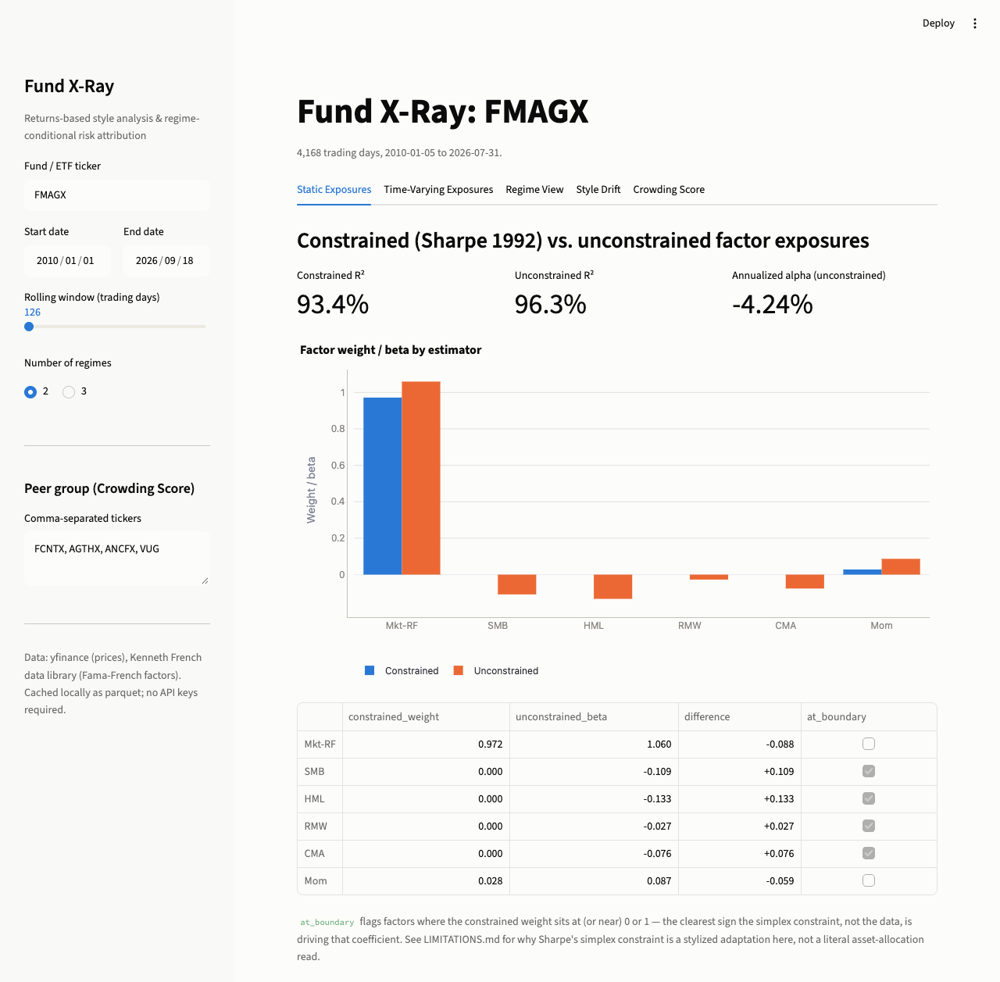

# Fund X-Ray — Returns-Based Style Analysis & Regime-Conditional Risk Attribution

**Status: all 10 build phases complete; deployment-ready (not yet deployed — see Deployment
below for what that requires).** See Build Order below.



## Problem statement

Given only a fund's public return series (no holdings disclosure), estimate its true factor
exposures, track how those exposures drift over time, and answer a harder question than a
single backtest can: what does this fund's risk actually look like *during a stress regime*,
as opposed to on average? This project builds that returns-based analysis pipeline end to end
— constrained style analysis, Kalman-filtered time-varying betas, HMM regime detection, and a
style-drift score — as a Streamlit dashboard.

**Key finding** (FMAGX, 2010–2026, SPY/VIX-derived regimes): idiosyncratic variance share
collapses from ~10% in calm markets to under 2% in stressed ones, while `Mkt-RF` beta barely
moves (~1.04 in both) — the fund's *market* exposure is stable, but its *diversification*
quietly disappears exactly when it matters most. A whole-sample static style analysis, run
alone, would never surface this; see the [regime-conditional risk metrics](#regime-conditional-risk-attribution-phase-5--done)
section below for the full table.

## Methodology (summary; full detail added as each phase lands)

- **Static style analysis**: Sharpe's (1992) constrained returns-based style analysis (factor
  weights bounded [0,1], summing to 1, solved via `scipy.optimize`), compared against an
  unconstrained Fama-French OLS regression with Newey-West (HAC) standard errors.
- **Time-varying exposure**: rolling-window OLS (naive baseline) vs. a Kalman filter treating
  factor betas as latent random-walk states — the Kalman approach should show materially less
  lag around known regime transitions.
- **Regime detection**: a Gaussian Hidden Markov Model (`hmmlearn`) fit on SPY/VIX, independent
  of the target fund, validated against known stress windows (2020 COVID crash, 2022 rate-hike
  selloff).
- **Regime-conditional risk**: VaR/CVaR, factor R², and idiosyncratic-vs-factor variance share,
  recomputed within each detected regime.
- **Style Drift Score**: a distance metric between a fund's current exposure vector and its own
  historical baseline (or a stated mandate), flagged when it exceeds baseline mean + 2·std.

## Repo structure

```
src/
  config.py            # all tunable parameters (dates, tickers, factor set, thresholds)
  data_loader.py        # DataLoader: fetches/caches/aligns prices + Fama-French factors
  style_analysis.py     # constrained + unconstrained regression (Phase 2)
  kalman_beta.py         # rolling OLS + Kalman filter time-varying beta (Phase 3)
  regime_detection.py    # HMM regime labeling (Phase 4)
  risk_metrics.py         # regime-conditional VaR/CVaR/R^2 (Phase 5)
  drift_score.py          # style drift + crowding score (Phase 6/7)
  viz_theme.py             # shared Plotly color/layout theme for app.py (Phase 8)
tests/                    # unit tests per module
notebooks/                # 01_methodology_walkthrough.ipynb (narrated validation)
docs/                     # README screenshot
app.py                    # Streamlit dashboard (Phase 8)
```

## Data sources (all free)

- Fund/ETF/stock returns: `yfinance` (daily adjusted close → log returns)
- Factors: Fama-French 5 factors + momentum, daily, via `pandas_datareader.famafrench`
- Regime signal: `^VIX` and/or realized SPY volatility via `yfinance`
- Peer group: configurable ticker list in `config.py` for the crowding score

## Data layer (Phase 1 — done)

`DataLoader` (`src/data_loader.py`) fetches prices and Fama-French factors, caches raw pulls
as parquet under `data/cache/` (skipped if the cache is fresh — 1 day for prices, 7 days for
factors), and returns a `FundDataset` with fund returns, excess returns, and factor returns
all aligned to a single inner-joined trading calendar.

**Missing-data policy**: dates that don't overlap across sources (e.g. a fund's inception date
newer than the factor history) are dropped, and every drop is logged with a row count and the
affected date range — there is no silent forward-fill.

```python
from src.data_loader import DataLoader

loader = DataLoader()
dataset = loader.build_fund_dataset("FMAGX", start="2015-01-01", end="2024-01-01")
dataset.fund_returns      # daily log returns
dataset.excess_returns    # fund_returns - risk_free
dataset.factor_returns    # Mkt-RF, SMB, HML, RMW, CMA, Mom
```

## Static style analysis (Phase 2 — done)

`src/style_analysis.py` implements the same linear factor model two ways, so the disagreement
between them is itself informative:

- **Constrained ("Sharpe") style regression** — Sharpe (1992): factor loadings are solved via
  `scipy.optimize` (SLSQP) subject to `beta_j >= 0` and `sum(beta_j) == 1`, no intercept. Note
  that Sharpe's simplex constraint was designed for fully-invested, long-only asset-class
  indices; applied here to the Fama-French/Carhart long-short factors it has no literal
  portfolio-allocation meaning, so read the constrained weights as *relative factor tilts*, not
  holdings. See [LIMITATIONS.md](LIMITATIONS.md).
- **Unconstrained Fama-French OLS** — estimated with an intercept (alpha) and Newey-West (1987,
  1994) HAC standard errors (automatic lag selection: `floor(4*(T/100)^(2/9))`), which corrects
  for the serial correlation typical of daily return regressions.

**Validation**: running constrained style analysis on `SPY` (2015–2024) loads 95.5% onto
`Mkt-RF` with R² = 0.99 — exactly the sanity check a market-tracking ETF should pass.

**Concrete finding**: on `FMAGX` (Fidelity Magellan, 2015–2024), the unconstrained regression
finds a clearly negative HML loading (-0.16, a growth tilt) and negative SMB (-0.14, a
large-cap tilt) — both real and economically sensible. The constrained model, unable to
represent negative exposures, forces both to exactly 0 and instead over-loads onto Mkt-RF
(0.97 vs. 1.04 unconstrained). This is precisely why both estimators are reported side by side:
the simplex constraint doesn't just add noise, it can hide a fund's actual style tilts.

```python
from src.style_analysis import run_constrained_style_analysis, run_unconstrained_ols, compare_style_results

constrained = run_constrained_style_analysis(dataset.excess_returns, dataset.factor_returns)
unconstrained = run_unconstrained_ols(dataset.excess_returns, dataset.factor_returns)
compare_style_results(constrained, unconstrained)  # side-by-side table, flags boundary weights
```

## Time-varying exposure (Phase 3 — done)

`src/kalman_beta.py` implements both a naive baseline and an improved estimator for the same
question — how does a fund's factor exposure move through time?

- **Rolling-window OLS** (252-day and 126-day): refit an ordinary least squares regression on
  the trailing window at every date. Simple, but has two known failure modes: it takes up to a
  full window to fully absorb a real shift (lag), and an old observation gets full weight right
  up until it drops out of the window, then vanishes abruptly (a "ghosting" step artifact).
- **Kalman filter**: factor betas follow a random walk (`beta_t = beta_{t-1} + w_t`), so every
  past observation contributes with exponentially decaying weight instead of a hard cutoff. The
  process-noise covariance uses the discount-factor trick from Bayesian dynamic linear models
  (West & Harrison, 1997): the posterior covariance is inflated by `1/(1-delta)` each step,
  which turns `delta` into a single, scale-free tuning knob expressible as a half-life
  (`half_life_days = ln(0.5)/ln(1-delta)`).

**Calibrating delta**: the first default I tried (`1e-4`, implying a ~19-year half-life) made
the filter essentially frozen — worse than useless for tracking anything. Sweeping delta and
checking the reaction speed around a real, dateable event (FMAGX's momentum-factor loading
around the Feb–Apr 2020 COVID crash) showed `delta=0.02` (~34-day half-life) gives a filter that
visibly leads the 126-day rolling estimate down during the crash, without amplifying day-to-day
noise. That sweep — not a formula — is what sets the default in `config.py`, and it's recorded
there so the choice isn't a mystery constant.

**Concrete finding**: for FMAGX's Momentum factor loading around March–April 2020, the Kalman
estimate reaches roughly the post-crash level (~0.11–0.13) by late April, while the 126-day
rolling estimate is still elevated (~0.15–0.17) at the same date — a real, measurable lag
reduction, not just a smoother-looking line.

```python
from src.kalman_beta import rolling_ols_betas, kalman_filter_betas, compare_lag_around_date

rolling = rolling_ols_betas(dataset.excess_returns, dataset.factor_returns, window=126)
kalman = kalman_filter_betas(dataset.excess_returns, dataset.factor_returns)  # delta from config
compare_lag_around_date(rolling, kalman, event_date=pd.Timestamp("2020-03-23"), factor="Mom")
```

## Regime detection (Phase 4 — done)

`src/regime_detection.py` fits a Gaussian Hidden Markov Model (`hmmlearn`) on **market-wide**
signals only — SPY daily returns plus VIX level (or trailing realized SPY volatility if VIX
isn't supplied) — deliberately never on the target fund's own returns. If "stressed" were
partly defined by the fund's own bad days, every downstream regime-conditional risk number
(Phase 5) would be circular. `hmmlearn` assigns state indices arbitrarily, so states are
relabeled after fitting by ascending mean of the volatility feature ("calm" is always the
lowest-volatility state).

Two standard HMM assumptions worth naming: the **Markov property** (tomorrow's regime depends
only on today's, with persistence captured solely through the fitted transition matrix), and
**Gaussian emissions** (daily returns are well known to have fatter tails than a Gaussian, so
this model can mistake an extreme single-day move for "regime noise").

**Validation** (2017–2024, 2-regime model, never fit on the stress-period dates themselves):

| Known stress period | Days flagged "stressed" |
|---|---|
| COVID crash (2020-02-19 to 2020-04-07) | 91.4% |
| 2022 rate-hike selloff (2022-01-03 to 2022-10-14) | 99.0% |

With a 3-regime model, the 2022 selloff splits 68% "stressed" / 32% "elevated" rather than
being nearly all "stressed" — a sensible distinction, since 2022 was a slower, grinding bear
market rather than an acute VIX spike like COVID, and the 3-state model captures that texture
that the 2-state model can't.

```python
from src.regime_detection import fit_regime_hmm, validate_against_known_stress_periods

result = fit_regime_hmm(spy_returns, vix=vix_series, n_regimes=2)
result.regime_labels          # "calm" / "stressed" per day
result.regime_probabilities   # smoothed posterior probability per regime
validate_against_known_stress_periods(result)  # sanity-check table above
```

## Regime-conditional risk attribution (Phase 5 — done)

`src/risk_metrics.py` recomputes, within each Phase-4 regime (plus "overall" as a baseline):
VaR(95%) and CVaR(95%) via **historical** (empirical-quantile) simulation rather than a
parametric/Gaussian formula — a stress regime concentrates exactly the extreme days that make
the normality assumption weakest, so a parametric VaR would understate tail risk in the regime
where it matters most; factor betas and R² via the same unconstrained OLS as Phase 2, refit on
only that regime's observations; and a per-factor **Euler variance decomposition**
(`beta_j * (Sigma_f @ beta)_j`), which sums exactly to the factor-driven share of total variance
(verified in tests), with the residual making up the idiosyncratic share.

**Concrete finding**: FMAGX's regime-conditional profile (2017–2024, SPY/VIX-derived regimes)
shows a large, real difference the whole-sample average hides —

| | Calm | Stressed |
|---|---|---|
| Annualized volatility | 10.7% | 29.5% |
| VaR (95%, daily) | 1.03% | 3.03% |
| CVaR (95%, daily) | 1.48% | 4.31% |
| R² | 90.3% | 98.2% |
| Idiosyncratic variance share | 9.7% | 1.8% |
| Mkt-RF beta | 1.04 | 1.04 |

The market beta itself barely moves (1.04 in both regimes) — what changes is how much of the
fund's *risk* is explained by that beta. In stress, idiosyncratic variance share collapses from
9.7% to 1.8%: the classic "correlations go to 1 in a crisis" effect, and one a static,
whole-sample style analysis would never surface.

```python
from src.risk_metrics import compute_regime_risk_metrics, regime_comparison_table

metrics = compute_regime_risk_metrics(
    dataset.fund_returns, dataset.excess_returns, dataset.factor_returns, regime_result.regime_labels
)
regime_comparison_table(metrics)  # one row per regime + "overall", side by side
```

## Style Drift Score (Phase 6 — done)

`src/drift_score.py` reduces each date's factor-exposure vector (from Phase 3's rolling or
Kalman betas — `const`/alpha is excluded, since it isn't a style exposure) to a single distance
from a baseline vector: either the fund's own exposure averaged over its first 12 months
(default), or a user-supplied stated-mandate vector. Two metrics are offered because they answer
different questions — **cosine distance** measures a change in exposure *shape* independent of
magnitude; **Euclidean distance** captures magnitude changes too. A drift event is flagged when
the score exceeds `baseline-period mean + 2·std`, calibrated to each fund's *own* baseline-period
noise rather than one universal cutoff.

**Concrete finding**: FMAGX's 126-day-rolling exposure vector shows brief, few-day drift blips
in 2015–2016 that fade back below threshold, then a sustained, permanent divergence starting in
2016–2019 that never reverts. Comparing the peak (2023-01-03) to the 2015 baseline: RMW flips
from -0.14 to +0.18 (weak- to robust-profitability tilt), CMA moves from -0.22 to +0.03 (less
aggressive-investment tilt), and HML moves further negative (-0.001 to -0.35, a stronger
growth/anti-value tilt) — a real, multi-factor style evolution over the fund's history, not
sampling noise.

```python
from src.drift_score import compute_style_drift

drift = compute_style_drift(rolling_result.betas, metric="cosine")  # or kalman_result.betas
drift.drift            # time series of distance-from-baseline
drift.threshold        # baseline mean + 2*std
drift.flagged_events   # contiguous episodes above threshold: start/end/peak_date/peak_drift
```

## Crowding Score (Phase 7 — stretch goal, done)

Also in `src/drift_score.py`: for a peer group of tickers, `build_peer_exposure_vectors()` fits
the same rolling-OLS betas from Phase 3 to each peer independently, and `compute_crowding_score()`
averages pairwise cosine *similarity* (not distance — 1.0 means every peer's exposure vector
points the same direction) across all peer pairs at each date. Peers are allowed ragged
histories (different inception dates, different rolling-window burn-ins): each date's score
uses whichever peers have valid data that day, and `n_peers_used` reports how many, so a score
built from 2 peers is never mistaken for one built from the whole group. A peer ticker that
fails to fetch (bad/delisted) is skipped and logged, not allowed to fail the whole calculation.

**Concrete finding**: the default peer group (`FCNTX`, `AGTHX`, `ANCFX`, `VUG` — all large-cap
growth funds/ETFs) shows persistently high average pairwise cosine similarity (2015–2024: mean
0.95, range 0.90–0.97) — genuinely overlapping, crowded positioning across the whole period,
not just during any one stretch. It ticks up modestly during the COVID window (mean 0.963 vs.
0.957 over a 2015–2016 baseline period) — a small effect, but directionally consistent with the
"correlations rise in stress" pattern already seen in Phase 5's regime-conditional risk metrics.

```python
from src.drift_score import build_peer_exposure_vectors, compute_crowding_score

peer_betas, skipped = build_peer_exposure_vectors(loader, config.DEFAULT_PEER_GROUP, start, end)
crowding = compute_crowding_score(peer_betas, skipped_tickers=skipped)
crowding.crowding        # time series of average pairwise cosine similarity
crowding.n_peers_used    # how many peers contributed to each date's score
```

## Streamlit dashboard (Phase 8 — done)

`app.py` wires every module above behind one sidebar (ticker, date range, rolling window,
regime count, peer group) into five tabs: **Static Exposures** (Phase 2's comparison chart and
table), **Time-Varying Exposures** (Phase 3's rolling-vs-Kalman overlay, toggleable per factor),
**Regime View** (Phase 4's regime-shaded price chart plus Phase 5's risk-metrics table and
stress-period validation), **Style Drift** (Phase 6's drift chart with threshold and flagged
episodes), and **Crowding Score** (Phase 7). All charts use a fixed, accessibility-validated
color palette (`src/viz_theme.py`) where each factor and each regime label keeps the same color
across every tab, and every network call / model fit is wrapped in `st.cache_data` /
`st.cache_resource` so Streamlit's rerun-on-every-interaction model doesn't re-fetch or re-fit
unless an actual input changed.

**No local-only paths, no secrets required**: `DataLoader`'s parquet cache is a relative path
under `data/cache/`, created on demand — this works unchanged on Streamlit Community Cloud's
ephemeral filesystem. Every data source (`yfinance`, the Kenneth French library) is free and
unauthenticated, so `st.secrets` isn't needed at all.

## Methodology notebook (Phase 9 — done)

[`notebooks/01_methodology_walkthrough.ipynb`](notebooks/01_methodology_walkthrough.ipynb) is a
single, executed, narrated run through every phase above on one real fund (`FMAGX`) — it exists
to *validate* each modeling decision (SPY's near-100% `Mkt-RF` loading, the Kalman filter
visibly leading the rolling window around the COVID crash, the regime model's agreement with
known stress windows) rather than just demonstrate the code. Every number in it comes straight
from `src/`, not from analysis duplicated in the notebook.

It's built and executed by `scripts/build_notebook.py` rather than hand-edited, so the
narrative text and the code it describes can't silently drift apart:

```bash
pip install -r requirements-dev.txt  # includes nbformat/nbclient/ipykernel
python -m ipykernel install --user --name fundxray --display-name "Fund X-Ray (.venv)"
python scripts/build_notebook.py
```

## Running locally

```bash
python3 -m venv .venv
source .venv/bin/activate
pip install -r requirements-dev.txt

pytest              # run the test suite
streamlit run app.py  # launch the dashboard at localhost:8501
```

## Deployment (Phase 10 — deployment-ready)

**Live dashboard**: _not yet deployed — this repo is deployment-ready; deploying it requires a
GitHub remote and a Streamlit Community Cloud account, which are the user's, not something this
assistant has access to. See below for the exact steps._

`requirements.txt` holds only what `app.py` actually imports (verified by installing it alone,
with no dev dependencies, into a throwaway virtualenv and confirming the app boots against a
cold — empty — parquet cache before this phase was called done). Two packages that snuck into
earlier phases' `requirements.txt` were removed once nothing in `src/`/`app.py` turned out to
import them: `pykalman` (the Kalman filter is hand-rolled in `src/kalman_beta.py` — see that
module's docstring for why) and `scikit-learn` (never used). `matplotlib` moved to
`requirements-dev.txt` since only the notebook needs it, not the dashboard.

To deploy on [Streamlit Community Cloud](https://share.streamlit.io):

1. Push this repo to a GitHub repository (public, or private if your Streamlit Cloud plan
   supports it).
2. At [share.streamlit.io](https://share.streamlit.io), "New app" → pick the repo/branch → set
   **Main file path** to `app.py`.
3. Under "Advanced settings," Python version should pick up `.python-version` (`3.12`)
   automatically; set it explicitly there if it doesn't.
4. No secrets to configure — every data source (`yfinance`, the Kenneth French library) is free
   and unauthenticated, so `st.secrets` is unused.
5. Deploy. Once live, replace the placeholder above with the app's `*.streamlit.app` URL.

**Known cold-start characteristic**: the first load after a deploy (or after Streamlit Cloud's
container sleeps from inactivity) fetches the default fund, SPY, VIX, and all 4 default peer
tickers, then fits the HMM and both time-varying-beta estimators — all five tabs' data, since
Streamlit re-runs the whole script on every load regardless of which tab is visually active.
Measured locally against a cold cache: ~25-30 seconds. Every subsequent interaction (switching
tabs, moving a slider) is fast, since `st.cache_data`/`st.cache_resource` mean only a changed
input triggers real work again.

## Build order

1. ✅ Scaffold repo structure + config + data loader, verify data pulls correctly
2. ✅ Static style analysis (constrained + unconstrained), validated against SPY
3. ✅ Rolling OLS and Kalman filter time-varying betas, compared visually
4. ✅ HMM regime detection, validated against known stress periods
5. ✅ Regime-conditional risk metrics
6. ✅ Style drift score
7. ✅ (Stretch) Crowding score
8. ✅ Streamlit dashboard wiring all modules together
9. ✅ README finding, LIMITATIONS.md, unit tests (plus the methodology notebook and a final
   type-hint/lint audit)
10. ✅ Prepare for Streamlit Cloud deployment (trimmed `requirements.txt`, verified a cold-cache
    boot in a dependencies-only virtualenv, added `.python-version`); actual deploy + live URL
    is the user's step, not something done from here — see **Deployment** above.

## Limitations

See [LIMITATIONS.md](LIMITATIONS.md) — covers what returns-based style analysis assumes, HMM
regime-count sensitivity, and what none of these methods can detect (intra-period trading,
hedges, or leverage changes that unwind before the return series is observed).
