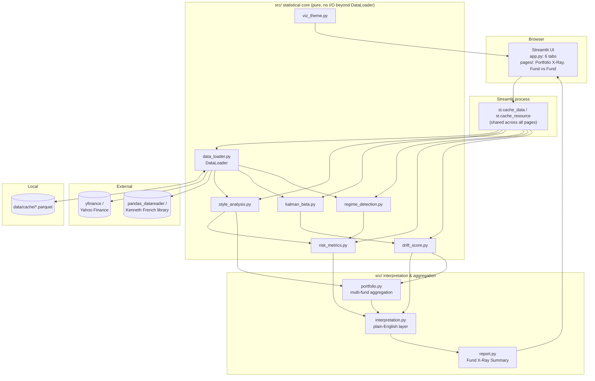
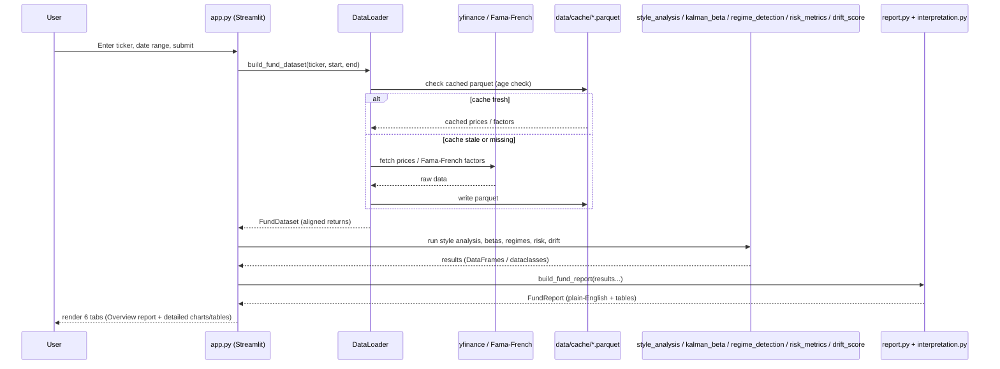

# Developer guide

Technical reference for working on Fund X-Ray. If you're looking for what the project is and
how to use it, see the [README](../README.md) instead — this doc is architecture, setup, and
testing detail for contributors.

## Tech stack

| Layer | Technology |
|---|---|
| Language | Python 3.12 |
| Dashboard / UI | Streamlit (multi-page: `app.py` + `pages/`) |
| Numerical computing | NumPy, pandas |
| Statistics / econometrics | statsmodels (Newey-West HAC), SciPy (`scipy.optimize` for constrained regression, `scipy.stats` for skew) |
| Regime detection | hmmlearn (Gaussian HMM) |
| Kalman filter | Hand-rolled implementation (`src/kalman_beta.py`) — no external Kalman library |
| Charting | Plotly |
| Market data | yfinance |
| Factor data | pandas-datareader (`famafrench` — Kenneth French data library) |
| Local caching | Parquet via pyarrow |
| Testing | pytest |
| Linting | ruff |
| Notebook generation | nbformat, nbclient, ipykernel (dev-only) |

Full pinned versions are in [requirements.txt](../requirements.txt) and
[requirements-dev.txt](../requirements-dev.txt). No new dependencies were added for the
interpretation/report/portfolio layers — `scipy.stats` and `plotly.express` ship inside
packages already required.

## System architecture and data flow

Fund X-Ray is a single-process Streamlit **multi-page** application — no backend API,
database, or message queue. `app.py` is the main entry point (single-fund analysis); Streamlit
auto-discovers `pages/1_Portfolio_X-Ray.py` and `pages/2_Fund_vs_Fund.py` as additional pages
with their own sidebars. All three scripts call the same `src/` modules directly, and
`st.cache_data`'s cache is process-wide, so a ticker fetched on one page is reused on another.

`src/` is layered: a **data layer** (`data_loader.py`), a **statistical core**
(`style_analysis.py`, `kalman_beta.py`, `regime_detection.py`, `risk_metrics.py`,
`drift_score.py`) that only returns numbers and dataclasses, an **interpretation layer**
(`interpretation.py`) that turns those numbers into plain-English, classified takeaways, a
**reporting layer** (`report.py`) that assembles a single-fund summary from already-computed
results, and a **portfolio layer** (`portfolio.py`) that aggregates across multiple funds. Every
Streamlit page is a thin UI shell over these — narrative text lives in `interpretation.py`, not
scattered through page scripts.



**Request flow, from entering a ticker to seeing the Overview tab:**



Every network call and iterative model fit is wrapped in `st.cache_data`/`st.cache_resource`,
since Streamlit reruns the entire script on every widget interaction — without caching, moving
a slider would re-download and re-fit everything. Cheap, pure computations (style regressions,
risk-metric aggregation, report assembly) are called directly rather than cached, since they run
in milliseconds on already-cached data.

## Project structure

```
fund-xray/
├── app.py                    # Streamlit dashboard (entry point; single-fund, 6 tabs)
├── pages/
│   ├── 1_Portfolio_X-Ray.py   # Multi-holding aggregation, blended exposure, diversification
│   └── 2_Fund_vs_Fund.py       # Side-by-side comparison of 2-3 tickers
├── src/
│   ├── config.py              # Central config: dates, tickers, factor set, thresholds
│   ├── data_loader.py         # DataLoader: fetch/cache/align prices + Fama-French factors
│   ├── style_analysis.py      # Constrained (Sharpe) + unconstrained OLS style regression + VIF
│   ├── kalman_beta.py         # Rolling-OLS and Kalman-filter time-varying betas
│   ├── regime_detection.py    # Gaussian HMM regime labeling, stability check, rule-based baseline
│   ├── risk_metrics.py        # Regime-conditional VaR/CVaR/R²/variance decomposition, fixed-beta check
│   ├── drift_score.py         # Style drift score + peer crowding score
│   ├── interpretation.py      # Plain-English interpretation layer (pure, no Streamlit/network)
│   ├── report.py               # Fund X-Ray Summary report assembly
│   ├── portfolio.py            # Multi-fund exposure aggregation and diversification
│   └── viz_theme.py           # Shared Plotly color/layout theme
├── tests/                     # One test module per src/ module, plus test_app.py / test_pages.py
├── notebooks/
│   └── 01_methodology_walkthrough.ipynb   # Generated, narrated end-to-end validation run
├── scripts/
│   └── build_notebook.py      # Builds the notebook above from code (not hand-edited)
├── docs/
│   ├── dashboard_screenshot.png
│   └── DEVELOPMENT.md          # This file
├── data/cache/                 # Local parquet cache (gitignored contents)
├── .streamlit/config.toml      # Streamlit theme + server settings
├── .devcontainer/               # VS Code / Codespaces dev container definition
├── requirements.txt             # Runtime dependencies only (what app.py imports)
├── requirements-dev.txt         # + pytest, ruff, notebook-build tooling
├── pyproject.toml                # ruff + pytest configuration
├── .python-version               # 3.12
├── LIMITATIONS.md                 # Documented modeling assumptions and known weaknesses
└── README.md
```

## Prerequisites

- Python **3.12** (pinned in `.python-version`; the included dev container uses a 3.11 base
  image, which also works)
- `pip`
- No database, no API keys, no external services requiring signup

## Installation and local setup

```bash
python3 -m venv .venv
source .venv/bin/activate        # Windows: .venv\Scripts\activate

pip install -r requirements-dev.txt   # runtime + test/lint/notebook tooling
# or: pip install -r requirements.txt   # runtime only

pytest              # run the test suite
streamlit run app.py  # launch the dashboard at localhost:8501
```

Streamlit auto-discovers `pages/1_Portfolio_X-Ray.py` and `pages/2_Fund_vs_Fund.py` and lists
them in the sidebar navigation — no extra command needed to reach them.

## Environment variables

**None are required.** Every data source used (`yfinance`, the Kenneth French data library via
`pandas_datareader`) is free and unauthenticated, so there is no `.env` file and `st.secrets`
is never read by the application code. `.streamlit/secrets.toml` is listed in `.gitignore` as a
precaution in case a fork adds secrets later, but no file of that name exists in this
repository and nothing currently reads from it.

## Database setup / local caching

There is no database. `DataLoader` (`src/data_loader.py`) persists each raw pull as a Parquet
file under `data/cache/`, keyed by ticker(s) and date range:

| Cache contents | Refresh interval |
|---|---|
| Price data (`yfinance`) | 1 day (`config.PRICE_CACHE_MAX_AGE_DAYS`) |
| Fama-French factor data | 7 days (`config.FACTOR_CACHE_MAX_AGE_DAYS`) |

There is no migration step — the cache directory is created on demand
(`CACHE_DIR.mkdir(parents=True, exist_ok=True)` in `config.py`), and deleting `data/cache/`
simply forces a fresh download on the next run. Cached `.parquet` files are excluded from
version control via `.gitignore`; this works unmodified on Streamlit Community Cloud's
ephemeral filesystem, where the cache is rebuilt from scratch after each cold start.

## Available commands

| Command | Purpose |
|---|---|
| `streamlit run app.py` | Launch the dashboard locally at `localhost:8501` |
| `pytest` | Run the full test suite (`tests/`, configured via `pyproject.toml`) |
| `ruff check .` | Lint `src/`, `app.py`, `pages/`, `tests/` (rules in `pyproject.toml`) |
| `python scripts/build_notebook.py` | Regenerate `notebooks/01_methodology_walkthrough.ipynb` from code |
| `python -m ipykernel install --user --name fundxray --display-name "Fund X-Ray (.venv)"` | Register a Jupyter kernel for the notebook (one-time, before `build_notebook.py`) |

## APIs and external integrations

No first-party backend API is exposed. Two third-party, unauthenticated data sources are
consumed, both wrapped exclusively inside `DataLoader` (`src/data_loader.py`) — no other module
makes a network call directly, which keeps the statistical code testable against synthetic data
and keeps any upstream flakiness isolated to one place:

| Integration | Library | Used for | Auth required |
|---|---|---|---|
| Yahoo Finance | `yfinance` | Daily adjusted close prices for the fund, its peer group, SPY, and `^VIX` | No |
| Kenneth French Data Library | `pandas_datareader.famafrench` | Fama-French 5 factors + momentum, daily | No |

## Testing

```bash
pytest
```

`pyproject.toml` scopes test discovery to `tests/`. There is one test module per `src/` module,
plus tests for the app and page layer:

```
tests/test_data_loader.py
tests/test_style_analysis.py
tests/test_kalman_beta.py
tests/test_regime_detection.py
tests/test_risk_metrics.py
tests/test_drift_score.py
tests/test_crowding_score.py
tests/test_interpretation.py
tests/test_report.py
tests/test_portfolio.py
tests/test_app.py
tests/test_pages.py
```

Notable coverage: the Euler variance decomposition in `risk_metrics.py` is checked to sum
exactly to the factor-driven share of total variance, not just to run without error;
`interpretation.py`'s classification functions are tested by constructing small synthetic
dataclass instances and asserting on the stable `tag` field rather than exact wording, so tests
don't break on a copy edit; `test_app.py`/`test_pages.py` are network-gated Streamlit `AppTest`
smoke tests (skipped without connectivity) that catch wiring/import errors the offline unit
tests can't. Lint (`ruff check .`) is configured for line length 100, `py311` target syntax,
and the `E`, `F`, `W`, `I`, `UP`, `B` rule sets, with `E501` ignored.

There is no continuous integration workflow configured in this repository (no `.github/`
directory) — tests and lint are run locally/manually.

## Deployment

Deployed on **Streamlit Community Cloud** from the `main` branch. To reproduce:

1. Push the repository to GitHub (public, or private if your Streamlit Cloud plan supports it).
2. At [share.streamlit.io](https://share.streamlit.io), choose **New app**, select the
   repo/branch, and set **Main file path** to `app.py`. The `pages/` directory deploys
   automatically alongside it — no separate configuration per page.
3. Python version is picked up from `.python-version` (`3.12`); set it explicitly under
   "Advanced settings" if it isn't detected.
4. No secrets to configure.
5. Deploy, and set the app's sharing setting to **public** for unauthenticated access.

**Cold-start behavior:** the first load after a deploy (or after the container sleeps from
inactivity) fetches the default fund, SPY, VIX, and all four default peer tickers, then fits the
HMM (plus a 5-seed stability refit) and both time-varying-beta estimators — everything the
main page's six tabs need, since Streamlit reruns the whole script on load. Measured locally
against a cold cache: roughly 25–35 seconds. The two `pages/` fetch and fit independently per
ticker entered, reusing any ticker's cache already warmed by another page. Subsequent
interactions are fast, since `st.cache_data`/`st.cache_resource` mean only a changed input
triggers real work again.

## Security considerations

- **No secrets to leak.** The app requires no API keys, tokens, or credentials of any kind —
  every data source is free and public.
- **No authentication or user accounts.** The dashboard is fully public/read-only; it doesn't
  collect, store, or transmit any personal data. All inputs (ticker, date range, peer list, and
  — on the Portfolio X-Ray page — the holdings/weights table) only affect which public market
  data is fetched and displayed; portfolio weights never leave the browser session and are
  never persisted anywhere.
- **User-supplied tickers are sanitized before touching the filesystem.**
  `DataLoader._cache_path` strips path separators and spaces out of cache keys before building
  a file path under `data/cache/`, which limits path-traversal risk from an arbitrary ticker
  string typed into the sidebar.
- **No `eval`/`exec` or shell interpolation of user input.** Ticker and peer-list strings flow
  only into `yfinance`/`pandas_datareader` calls and pandas indexing, not into any command
  execution.
- **Third-party data is not blindly trusted.** Missing or non-overlapping dates across sources
  are dropped and logged rather than silently filled, and a failed peer-ticker fetch is skipped
  and logged rather than allowed to crash the run or propagate a bad value.
- Because this is a data-analysis dashboard with no write path, no database, and no user
  accounts, most conventional web-app attack surfaces (SQL injection, session hijacking, CSRF,
  stored XSS from user content) don't apply.

## Current status / roadmap

**Status:** feature-complete for its current scope. The statistical core (style analysis,
time-varying betas, regime detection, regime-conditional risk, drift/crowding scores) is
implemented and tested, with a plain-English interpretation layer, a one-screen Fund X-Ray
Summary report, and two multi-fund pages (Portfolio X-Ray, Fund vs. Fund) built on top of it.
Robustness checks shipped alongside the core: Newey-West standard errors/p-values in the UI, a
factor-multicollinearity (VIF) check, a fixed-beta cross-check on the regime-conditional risk
finding, and a multi-seed stability check plus a rule-based baseline backing up the HMM's
calm/stressed split.

[LIMITATIONS.md](../LIMITATIONS.md) documents several enhancements considered but not
implemented, which stand as a natural roadmap if this project continues:

- Fit the Kalman filter's `delta` (process-noise) parameter via maximum likelihood instead of a
  one-off empirical sweep against a single event.
- Let Kalman observation variance vary over time (e.g. a regime-conditional or separately
  filtered variance) instead of assuming it's constant for the whole sample.
- Select HMM regime count via an information criterion (e.g. BIC) instead of a fixed
  user-selectable 2/3-regime choice.
- Apply shrinkage toward the whole-sample estimate for short, noisy regimes' risk metrics.
- Expose the full pairwise similarity matrix behind the single-fund Crowding Score, not just
  its average (Portfolio X-Ray already exposes this matrix at the portfolio level).
- Support point-in-time (expanding-window) regime refitting for real-time nowcasting, rather
  than the current retrospective, whole-history HMM fit.
- Replace Portfolio X-Ray's linear-interpolation "effective independent bets" heuristic with a
  more rigorous diversification estimator based on the portfolio's actual return covariance
  matrix, not just factor-exposure cosine similarity.
